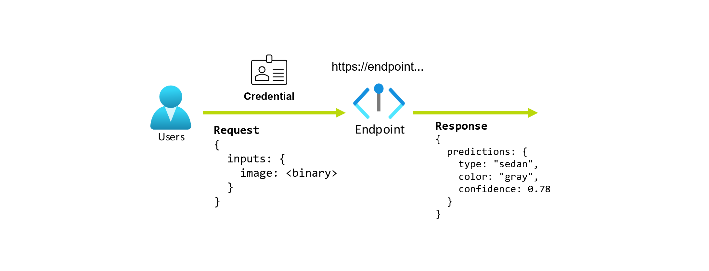

# Train a dummy classifier and deploy the model to Azure

Train a dummy classifier to find out the topic given a social media post. Afterwards, deploy the trained model to
Azure online endpoints. User can send request to the endpoint to predict the topic of a social media post.



## Prerequisites

* Python 3.7 or later
* Dependencies in requirements.txt

```
pip install -r requirements.txt
```

